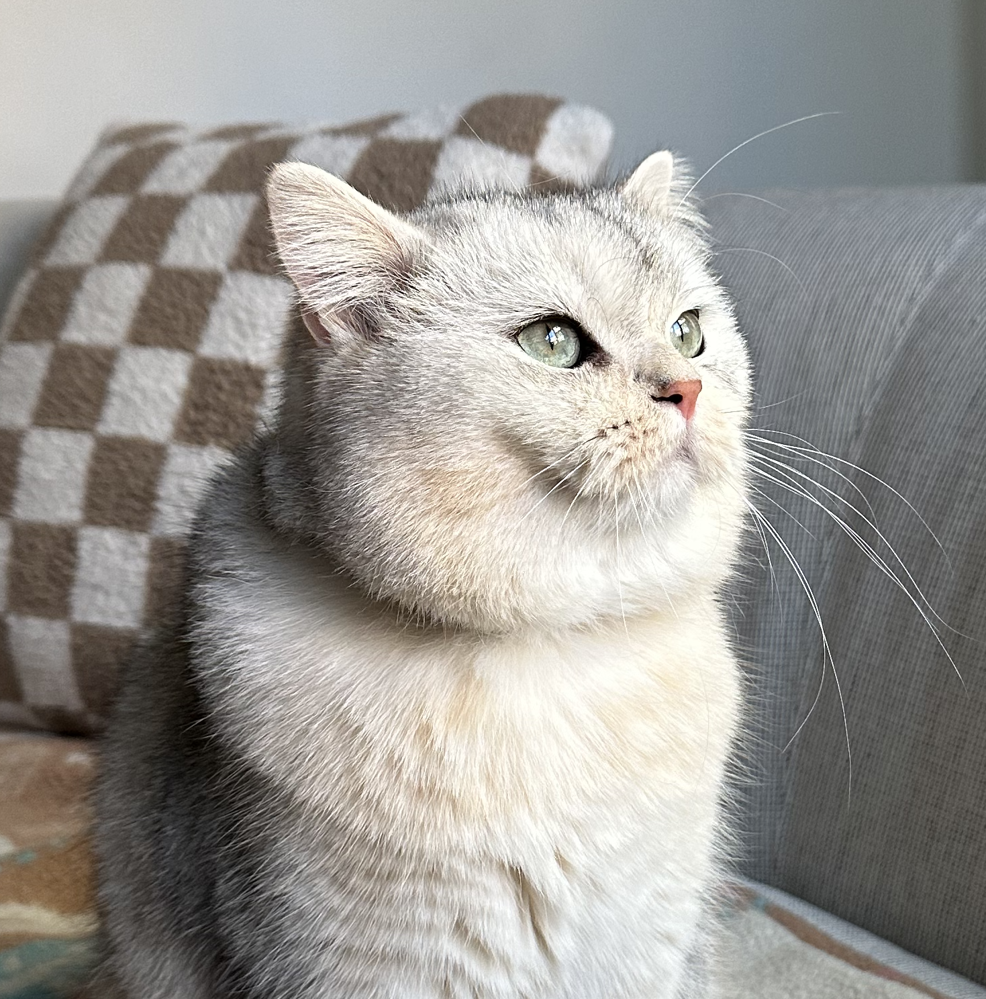
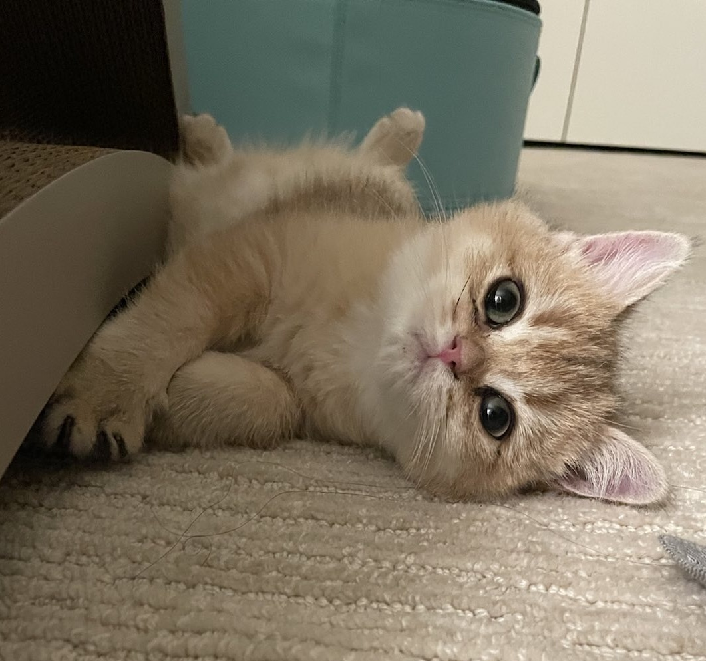

<div align="center">
  <picture>
    <source media="(prefers-color-scheme: dark)" srcset="docs/static/logo-dark.svg">
    <source media="(prefers-color-scheme: light)" srcset="docs/static/logo-light.svg">
    
  </picture>
</div>
<h3 align="center">
    <a href="#getting-started">Getting Started</a>
    <span> · </span>
    <a href="#why-use-mcpcat-">Features</a>
    <span> · </span>
    <a href="https://docs.mcpcat.io">Docs</a>
    <span> · </span>
    <a href="https://mcpcat.io">Website</a>
    <span> · </span>
    <a href="#free-for-open-source">Open Source</a>
    <span> · </span>
    <a href="https://discord.gg/n9qpyhzp2u">Discord</a>
</h3>
<p align="center">
  <a href="https://badge.fury.io/js/mcpcat"></a>
  <a href="https://www.npmjs.com/package/mcpcat"></a>
  <a href="https://opensource.org/licenses/MIT"></a>
  <a href="https://www.typescriptlang.org/"></a>
  <a href="https://github.com/MCPCat/mcpcat-typescript-sdk/issues"></a>
  <a href="https://github.com/MCPCat/mcpcat-typescript-sdk/actions"></a>
</p>

> [!NOTE]
> Looking for the Python SDK? Check it out here [mcpcat-python](https://github.com/mcpcat/mcpcat-python-sdk).

MCPcat is an analytics platform for MCP server owners 🐱. It captures user intentions and behavior patterns to help you understand what AI users actually need from your tools — eliminating guesswork and accelerating product development all with one-line of code.

This SDK also provides a free and simple way to forward telemetry like logs, traces, and errors to any Open Telemetry collector or popular tools like Datadog and Sentry. 

```bash
npm install -S mcpcat
```

To learn more about us, check us out [here](https://mcpcat.io). For detailed guides visit our [documentation](https://docs.mcpcat.io).

## Why use MCPcat? 🤔

MCPcat helps developers and product owners build, improve, and monitor their MCP servers by capturing user analytics and tracing tool calls.

Use MCPcat for:

- **User session replay** 🎬. Follow alongside your users to understand why they're using your MCP servers, what functionality you're missing, and what clients they're coming from.
- **Trace debugging** 🔍. See where your users are getting stuck, track and find when LLMs get confused by your API, and debug sessions across all deployments of your MCP server.
- **Existing platform support** 📊. Get logging and tracing out of the box for your existing observability platforms (OpenTelemetry, Datadog, Sentry) — eliminating the tedious work of implementing telemetry yourself.


## Getting Started

To get started with MCPcat, first create an account and obtain your project ID by signing up at [mcpcat.io](https://mcpcat.io). For detailed setup instructions visit our [documentation](https://docs.mcpcat.io).

Once you have your project ID, integrate MCPcat into your MCP server:

```ts
import * as mcpcat from "mcpcat";

const mcpServer = new Server({ name: "echo-mcp", version: "0.1.0" });

// Track the server with MCPCat
mcpcat.track(mcpServer, "proj_0000000");

// Register your tools
```

### Identifying users

You can identify your user sessions with a simple callback MCPcat exposes, called `identify`.

```ts
mcpcat.track(mcpServer, "proj_0000000", {
  identify: async (request, extra) => {
    const user = await myapi.getUser(request.params.arguments.token);
    return {
      userId: user.id,
      userName: user.name,
      userData: { favoriteColor: user.favoriteColor },
    };
  },
});
```

### Redacting sensitive data

MCPcat redacts all data sent to its servers and encrypts at rest, but for additional security, it offers a hook to do your own redaction on all text data returned back to our servers.

```ts
mcpcat.track(mcpServer, "proj_0000000", {
  redactSensitiveInformation: async (text) => await redact(text),
  // or
  redactSensitiveInformation: (text) => redact(text),
});
```

### Existing Platform Support

MCPcat seamlessly integrates with your existing observability stack, providing automatic logging and tracing without the tedious setup typically required. Export telemetry data to multiple platforms simultaneously:

```typescript
mcpcat.track(server, "proj_0000", {
  // Project ID can optionally be "null" if you just want to forward telemetry
  exporters: {
    otlp: {
      type: "otlp",
      endpoint: "http://localhost:4318/v1/traces",
    },
    datadog: {
      type: "datadog",
      apiKey: process.env.DD_API_KEY,
      site: "datadoghq.com",
      service: "my-mcp-server",
    },
    sentry: {
      type: "sentry",
      dsn: process.env.SENTRY_DSN,
      environment: "production",
    },
  },
});
```

Learn more about our free and open source [telemetry integrations](https://docs.mcpcat.io/telemetry/integrations).

## Free for open source

MCPcat is free for qualified open source projects. We believe in supporting the ecosystem that makes MCP possible. If you maintain an open source MCP server, you can access our full analytics platform at no cost.

**How to apply**: Email hi@mcpcat.io with your repository link

_Already using MCPcat? We'll upgrade your account immediately._

## Community Cats 🐱

Meet the cats behind MCPcat! Add your cat to our community by submitting a PR with your cat's photo in the `docs/cats/` directory.

<div align="left">
  
  
</div>

_Want to add your cat? Create a PR adding your cat's photo to `docs/cats/` and update this section!_
